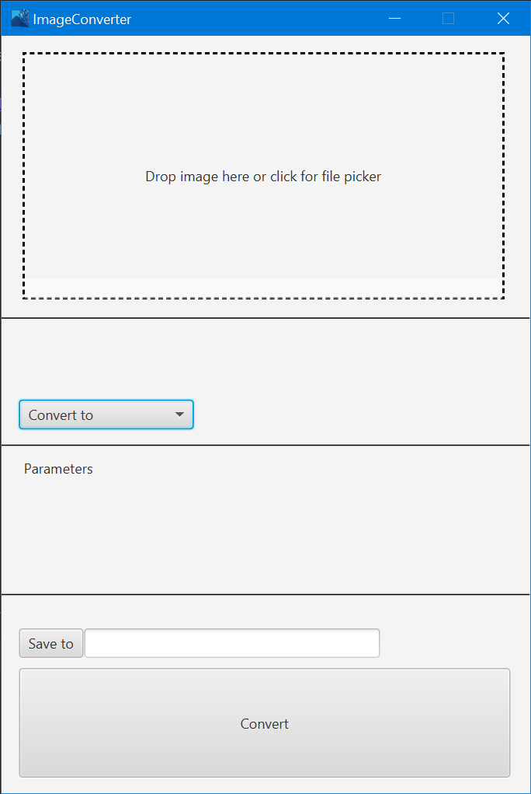

# ImageConverterJava
ImageConverter for java 14

Uses JavaFX and [TwelveMonkeys](https://github.com/haraldk/TwelveMonkeys)
Supports a bunch of formats. Image can be imported via drag and drop, file select, and from the clipboard. Screen snips can be pasted right in as well as image copied from the internet.

;